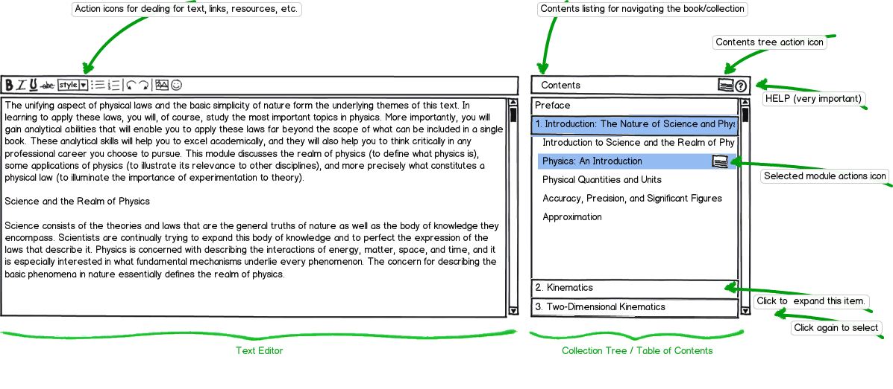
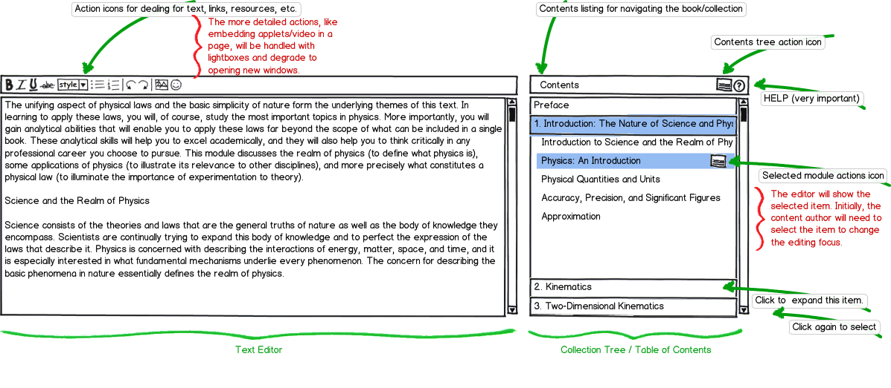

CNX Editor
==========

Contents:

.. toctree::
   :maxdepth: 2

The purpose of this document is to provide a comprehensive visual
discussion of the (new) CNX Editor and associated components.

Common terms
------------

.. glossary::

   Collection
      A list of :term:`modules <module>` and sub-collections. This type of object is
      used to organize the parts of a book (modules).

   Module
      A piece of text that usually focuses on a specifc topic. This
      type of object contains the actual content and resources in a book.

   Section
      A small sub-topic within a :term:`module`. ???

   Text Editor
      An HTML text box that has some :abbr:`WYSIWYG (what you see is
      what you get)` features. This text box allows the user to modify
      the content of a module.

   Collection tree
      The items in a :term:`collection` list.

   Table of contents
      A displayable version of the :term:`collection` list.

   Book tree
      This is the same as :term:`collection tree`.

A single unifying text editor
-----------------------------

The following image is a wireframe based on our design discussion on July
10th, 2012.

.. image:: _static/cnx-editor.png

Now with annotation...
----------------------

The annotations in this image display the various elements that may
not be clear at first sight.

The two basic widgets to the editor are the :term:`text editor`
itself and the :term:`collection tree`. The text editor is a fairly
standard component that could be any normal text editor or one that we
design ourselves. The actions icons at the top of the editor control
basic text editing functionality as well as the more advanced editing
features. 

The :term:`collection tree` is used to navigate the entire book. This
widget will also control the reorganization of the collection via
drag and drop options. If javascript is disabled this widget can be
made to degrade with simple links to actions. For example, adding a
module to the contents can be handled by lightbox dialogs that can be
reused in a standalone page scenario. The collections metadata can be
viewed and modified via the collection tree's action icon button. This
action icon link can be made house all the important details for
editing the collection itself (accredidation, sharing, licensing,
etc.).

More annotation...
------------------

And a few more comments on this image...

The action icons on the text editor will have actions for the tabs
that are currently in the cnx.org editor (e.g. links and metadata). As
the image says, these more advanced actions will out a lightbox
dialog to interact with the controls. This also means that the actions
will degrade if javascript has been disabled.

The actions in the :term:`collection tree` are fairly simple. This is
intended to help keep the content author focused on the content rather
than the organization of the content. When the user needs more
information, the action to do so is only a click away. 

Double clicking on the content element in the collection tree will
prepare the item in the :term:`text editor`. If the items that is
currently being edited has not been saved, the content author will be
prompted to save before moving forward.

Indices and tables
==================

* :ref:`genindex`
* :ref:`modindex`
* :ref:`search`

