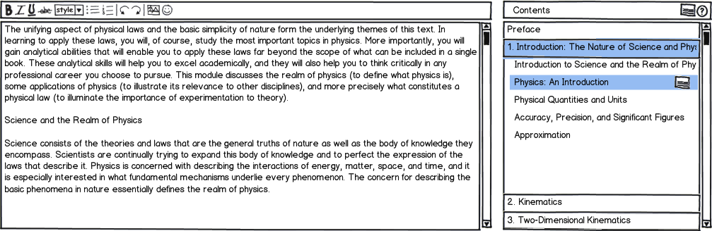

CNX Editor
==========

Contents:

.. toctree::
   :maxdepth: 2

The purpose of this document is to provide a comprehensive visual
discussion of the (new) CNX Editor and associated components.

Common terms
------------

.. glossary::

   Collection
      A list of :term:`modules <module>` and sub-collections. This type of object is
      used to organize the parts of a book (modules).

   Module
      A piece of text that usually focuses on a specifc topic. This
      type of object contains the actual content and resources in a book.

   Section
      A small sub-topic within a :term:`module`. ???

   Text Editor
      An HTML text box that has some :abbr:`WYSIWYG (what you see is
      what you get)` features. This text box allows the user to modify
      the content of a module.

   Collection contents
      The items in a :term:`collection` list.

   Table of contents
      A displayable version of the :term:`collection` list.

   Book tree
      This is the same as :term:`collection contents`.

A single unifying text editor
-----------------------------

The following image is a wireframe based on our design discussion on July
10th, 2012.

Indices and tables
==================

* :ref:`genindex`
* :ref:`modindex`
* :ref:`search`

